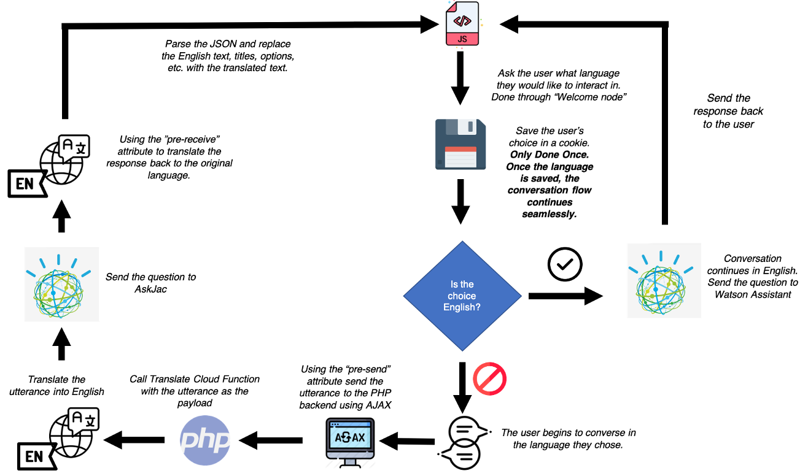
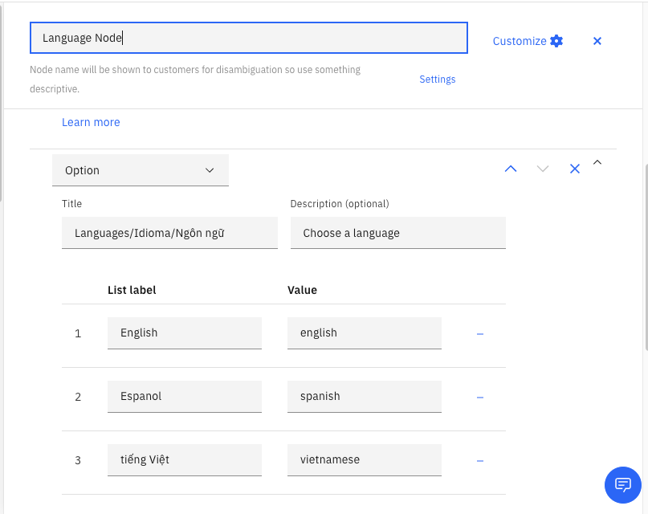

# Watson Assistant + Language Translator Integration

## Architecture

Language Translation with Watson Assistant Integration

### How it works

1. The Assistant presents an array of languages for the user to interact in.
2. The user chooses which language to interact in, and the choice is saved.
3. The Language Translator translates the user's utterance before it reaches WA, and translates the response back to the user's language.
4. If the user does not choose a language, it defaults to English

## Running Locally & Integrating your Assistant

### Requirements

1. python 3.*
2. IBM Cloud Function URL

### Install the dependencies

`pip install -r requirements.txt`

## Modifications

### Modifications to the Assistant

1. Create a `Welcome node` to ask the user the preferred language
2. The `Welcome node` **must** present the user with a list of options of languages for the user to choose. The value of the options is parsed by the Javascript front-end for live-translation. *(Described in more detail below)*

### Modifications in templates/homepage.html
1. On line 171, change the values of the array `languageSupported` to the values of the options (like above). The values in the array must match exactly to the value of the options in Watson Assistant tooling. 
2. On line 172, change the `mapping` variable to the corresponding [language code](https://cloud.ibm.com/docs/language-translator?topic=language-translator-translation-models).

### Modifications in background.py
1. Deploy the cloud functions as an [API](https://cloud.ibm.com/docs/openwhisk?topic=openwhisk-apigateway) to your IBM Cloud account.
2. Change line 56 to the Cloud Function API URL.

## How to Run
1. `python3 backend.py`
2. Navigate to the `localhost:4000`
